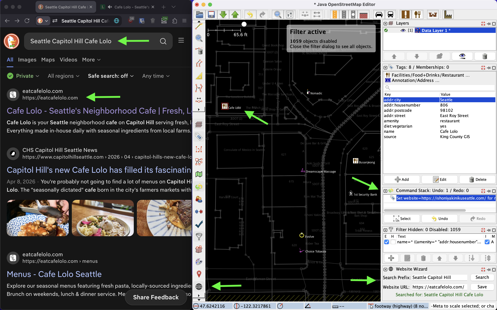

# `josm-plugin-website-wizard`

[`josm-plugin-website-wizard`](https://github.com/High5Apps/josm-plugin-website-wizard) is a [JOSM](https://josm.openstreetmap.de/) plugin to help you add a [`website` tag](https://wiki.openstreetmap.org/wiki/Key:website) to places in [OpenStreetMap](https://www.openstreetmap.org) as quickly and easily as possible.


## Why?
Once a place in OpenStreetMap has a `website` tag, it becomes way easier to determine other helpful info about that place! Almost every place's official website has info about its [`phone`](https://wiki.openstreetmap.org/wiki/Key:phone), [`opening_hours`](https://wiki.openstreetmap.org/wiki/Key:opening_hours), [`email`](https://wiki.openstreetmap.org/wiki/Key:email), and [other tags](https://taginfo.openstreetmap.org/). So adding a `website` tag is a simple way to meaningfully contribute to OpenStreetMap!

The United States alone has more than 1 million shops! So if we want to put them all on the map, it better be as quick and easy as possible to tag a single place. Website Wizard does exactly that.

## Screenshots



## Installation

1. If you haven't already, [install](https://wiki.openstreetmap.org/wiki/JOSM/Installation) and open JOSM
2. Open the JOSM [Preferences Dialog](https://josm.openstreetmap.de/wiki/Help/Action/Preferences)
3. Click the **puzzle piece icon** to configure available plugins
4. Scroll down until you see **WebsiteWizard**
5. Check the **checkbox**
6. Click **OK** to install it. (There's no need to restart JOSM.)

## Usage

### Getting Started
1. Open JOSM
2. [Download data](https://josm.openstreetmap.de/wiki/Help/Action/Download) for the area you're interested in
3. On the left side of JOSM, scroll down until you see the Website Wizard **globe icon** (🌐)
4. Click the globe icon to toggle the Website Wizard panel on the right size of JOSM
5. On the left side of JOSM, scroll until you see the **filter icon** and click to toggle it on
6. In the **filter panel** on the right side of JOSM, click the **+ button** 
7. Copy and paste the following into the **Search string** text field, and then click **Submit filter**
```
name=* ((amenity=* "addr:housenumber"=*) | shop=*) -website=* -"contact:website"=*
```
8. In the **filter panel**, check **E**, uncheck **H** and check **I**
9. In the Website Wizard panel's **Search Prefix** text field, type the city name and/or neighborhood name for your area of interest.

### Adding Tags
1. Click one of the places in your area
2. Click **Search** to open a web browser and search for the place name
3. Determine whether any of the search results are the official website for the place. Most official websites include their address somewhere on the page, so it's strongly recommended to find the address on the page to be sure.
    - REMINDER: The [`website=*`](https://wiki.openstreetmap.org/wiki/Key:website#Usability) tag is only for **official websites**, not for general web links. So do not add the website if it's just a social media page, review aggregator, or other unofficial business aggregation site.
4. If you found the place's official website, copy and paste its URL into the **Website URL** text field of the Website Wizard panel and click **Save**
5. Repeat steps 1-5 for each place in your area

### Uploading Your Changeset
1. Click the **Up icon** at the top of JOSM
2. In the text field labeled **Provide a brief comment for the changes you are uploading**, type something like `Add website to <city/neighborhood> shops and amenities`
3. In the dropdown labeled **Specify the data source for the changes**, select `survey`
4. Uncheck **I would like someone to review my edits**
5. Click **Upload Changes**

## Advanced Settings

### Keys
- `websitewizard.search-provider-url-prefix`
    - Default value: `https://duckduckgo.com/?q=`
    - Change this key to use a different search provider (e.g. `https://bing.com/?q=`)

### How to update Advanced Settings
1. Open the JOSM [Preferences Dialog](https://josm.openstreetmap.de/wiki/Help/Action/Preferences)
2. If needed, check the **Expert Mode** checkbox at the bottom left of the Preferences Dialog
3. On the left side of the Preferences Dialog, scroll down until you see the very last icon, then click it to show the **Advanced Preferences Pane**
4. In the search box, paste in `websitewizard` to filter to only the preferences for this plugin
5. Double click the value next to the key that you want to update and type in your preferred value 
    - If you don't see one of the [Keys](#keys) listed above, click the **+ Add** button, paste the key into the **Key** text field, click **OK**, type your desired value into the **Value** text field, then click **OK**
6. After you've set your desired value for the key, click **OK** to close the Preferences Dialog

## Development

### Setup

1. [Download JOSM](https://josm.eu/wiki/Download) and install it
2. Pull the JOSM repo
```
cd ~/path/to/your/git/folder
svn co https://josm.openstreetmap.de/osmsvn/applications/editors/josm
```
3. [Download `JOSM-tested.jar`](https://josm.eu/wiki/Download#Recommendedoptions) and move it into `josm/core/dist/`
4. Pull the `josm-plugin-website-wizard` repo
```
cd ~/path/to/your/git/folder
git pull git@github.com:High5Apps/josm-plugin-website-wizard.git
```
5. If you don't have it already, [install `ant`](https://ant.apache.org/manual/install.html). For example, on a Mac you can use `brew install ant`
6. Build the `josm-plugin-website-wizard` plugin
```
cd josm-plugin-website-wizard/plugins/website_wizard
ant clean
ant dist
```
7. Move the plugin jar file into your local JOSM plugins directory
```
ant install
```
8. Enable and use the plugin by following the [Usage](#usage) instructions above

### Creating a New Release

A link to the latest release of Website Wizard's `.jar` file was already added to JOSM's external [PluginsSource](https://josm.openstreetmap.de/wiki/PluginsSource) (i.e. `https://github.com/High5Apps/josm-plugin-website-wizard/releases/latest/download/WebsiteWizard.jar`). So creating a new release on GitHub will automatically create a new release in JOSM. The PluginSource parser automatically runs every 10 minutes, at which time the new version will be available in JOSM. You may need to click **Download list** in JOSM's Plugin Preferences pane to refresh the list of plugins.

To create a new GitHub release:
1. `git tag v1.X.Y && git push origin v1.X.Y`
2. Draft a [new release](https://github.com/High5Apps/josm-plugin-website-wizard/releases/new) on GitHub
3. Drag-and-drop the new `.jar` file from `dist/WebsiteWizard.jar` onto the new release page to attach it to the new release
4. Click **Publish release**
